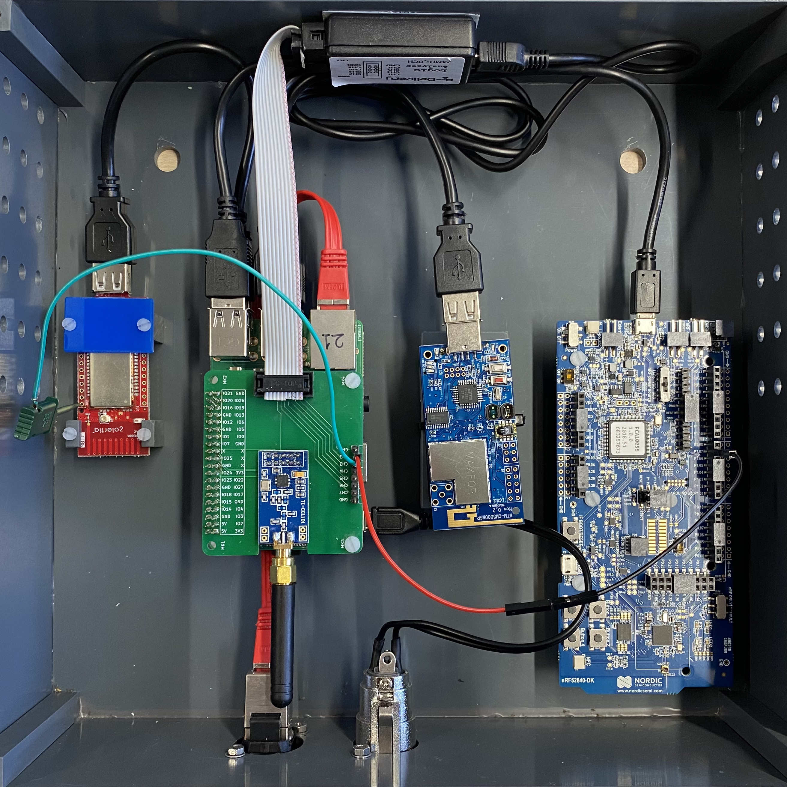
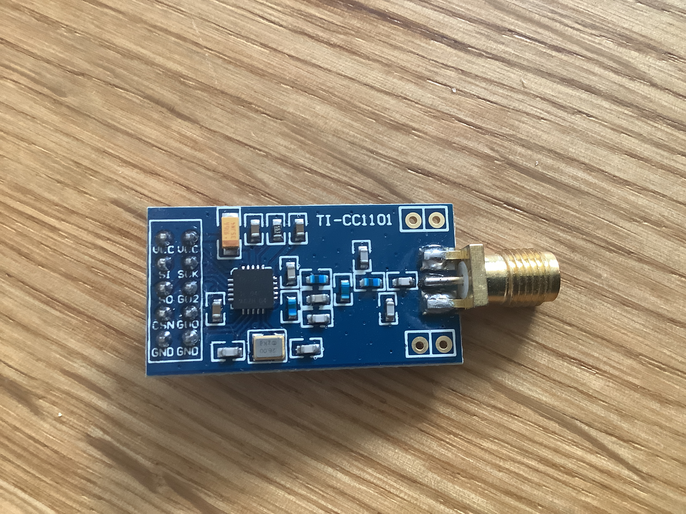
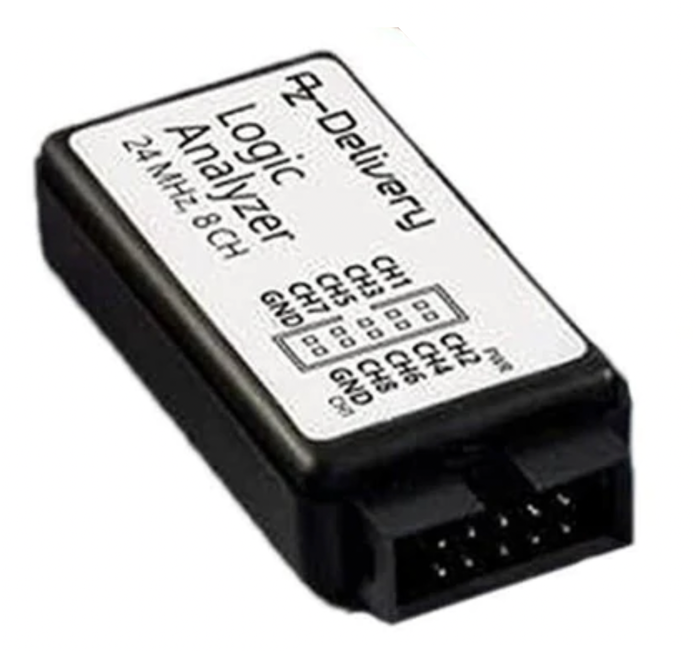

# Description
This simple PCB can be used to wire together the development boards for easier
deployment. Alternatively, one can simply wire together everything using jumper wires. We produced
our PCBs at [JLCPCB](https://jlcpcb.com/), look below for our order configuration.
 The schematic files can be opened and exported to gerber files using
[KiCad](https://www.kicad.org/).  You can also look at the schematic for a reference as to how to
wire everything together.

# Hardware
## Receiver
We use a commonly available of-the-shelf cc1101 development board for our setup.  If you want to use
our circuit board for deployment, you need to get a board with the same pin-out configuration.  If
you don't want to use our board and use jumper wires instead, you can get one of the other commonly
available development boards. Just make sure that at least one GPIO (GDx) is exposed.

## Logic Analyzer
Use one of the commonly available ez-usb fx2lp based logic analyzer if you want to use our
PCB. Otherwise, if you jump wire everything you can also use a fx2lp development board.

## Miscellaneous
- [2.54mm 10pin Straight Type Box Header](https://www.reichelt.de/wannenstecker-10-polig-gerade-wsl-10g-p22816.html)
- [2.54mm 10pin IDC Socket](https://www.reichelt.de/pfostenbuchse-10-polig-mit-zugentlastung-pfl-10-p14571.html?&trstct=pos_0&nbc=1)
- IDC Ribbon Cable

# PCB Order Configuration

- Base Material: FR-4
- Layers: 2
- Dimension: 65 mm* 56 mm
- PCB Thickness: 1.6
- PCB Color: Green
- Silkscreen: White
- Surface Finish: HASL(with lead)
- Deburring/Edge rounding: No
- Outer Copper Weight: 1
- Gold Fingers: No
- Castellated Holes: no
- Material Type:FR4-Standard Tg 130-140C
- Appearance Quality:IPC Class 2 Standard 
